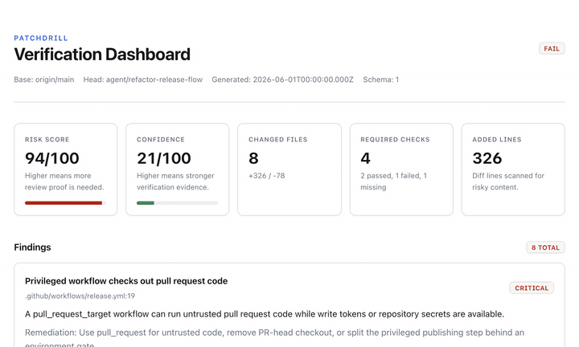

# PatchDrill

[English](README.md) · **한국어** · [日本語](README.ja.md) · [中文](README.zh.md)

[](https://github.com/seungdori/patchdrill/actions/workflows/ci.yml)


## AI 리뷰어는 LGTM이라고 합니다. CI도 초록불입니다. 그래도 이 PR은 머지하면 안 됩니다.

PatchDrill은 AI가 생성한 패치와 사람이 작성한 패치 모두에 대해 **코드 리뷰와 CI 사이에 놓이는 결정론적 증명 계층(deterministic proof layer)입니다.** git diff를 읽고, 머지하기 전에 어떤 증거가 갖춰져 있어야 하는지 정확히 짚어 줍니다 — **모델 호출도, 네트워크도 없이 매번 같은 답을 냅니다.**

**린터도, SAST도, AI 리뷰어도 아닙니다.** PatchDrill은 그 도구들이 결코 묻지 않는 단 하나의 질문에 답합니다. *바로 이 diff에 대해 머지 전에 어떤 증거가 존재해야 하는가 — 그리고 무엇이 빠져 있는가?*

[](docs/media/patchdrill-dashboard.png)

*AI 에이전트가 이 PR을 열었습니다. PatchDrill은 이를 **FAIL · 94/100** 으로 평가했습니다 — 권한이 부여된 `pull_request_target` 워크플로 체크아웃, 유출된 시크릿, 비활성화된 테스트 스크립트를 오프라인·결정론적 명령 하나로 잡아냈습니다. 모델 호출 없음. (전체 리포트 스크린샷을 보려면 클릭하세요. GIF는 `vhs demo/patchdrill.tape`로 다시 생성할 수 있습니다.)*

**diff에서 잡아내는 것:**

- **유출된 시크릿** — 패치에 추가된 `.env` 파일, 개인 키, 토큰 형태의 문자열
- **프롬프트 인젝션** — 에이전트가 읽게 될 `AGENTS.md`, 이슈 템플릿, 문서에 슬쩍 끼워 넣은 지시문
- **워크플로 권한 상승** — 광범위한 토큰 쓰기 권한, `pull_request_target`, OIDC 교환, `secrets: inherit`, 핀 고정되지 않은 액션, 원격 스크립트 파이프
- **빠진 증거** — 소스가 바뀌었는데 테스트는 바뀌지 않음. 필수 체크가 계획만 되고 실행되지 않음
- **의존성 드리프트** — 매니페스트가 바뀌었는데 대응되는 락파일이 없음(그리고 매니페스트 의도가 없는 락파일 드리프트)
- **이 diff에 필요한 검증** — *변경된* 패키지와 그 패키지에 의존하는 다운스트림 패키지에 대해, 루트 수준 기본값만이 아니라 약 25개 생태계 전반에 걸친 실제 명령

> **이제 모든 diff를 눈으로 일일이 확인할 수 없게 된, AI·에이전트가 작성한 PR을 머지하는 팀을 위해 만들었습니다.** 30초 만에 로컬에서 실행하세요 — 설정 불필요, CI 변경 불필요, API 키 불필요:
>
> ```bash
> npx --yes patchdrill demo --scenario risky-agent-pr
> ```

출력물은 어디서나 가져가 검사할 수 있는 **Proof Pack(증거 묶음)입니다** — Markdown, JSON, SARIF, 자체 완결형 HTML 대시보드, 그리고 해시가 찍힌 증거 매니페스트로 구성되며, 사람, CI 게이트, 감사자, 프런티어 모델이 모두 검사할 수 있습니다. `--locale ko|ja|zh` 로 원하는 언어로 실행하세요.

## 30초 데모

git 저장소 없이도 위험한 AI 에이전트 PR 시나리오를 생성합니다:

```bash
npx --yes patchdrill demo --scenario risky-agent-pr --output patchdrill-risky-demo
```

그런 다음 리뷰어용 산출물을 살펴보세요:

```bash
cat patchdrill-risky-demo/patchdrill-demo-summary.md
open patchdrill-risky-demo/patchdrill-demo.html
```

PatchDrill은 권한이 부여된 워크플로 경계, 시크릿처럼 보이는 콘텐츠, 패키지 라이프사이클 스크립트 위험, 그리고 머지 전에 리뷰어가 요구해야 할 검증 계획을 보여줍니다.

```bash
npx --yes patchdrill scan --base origin/main --run \
  --evidence patchdrill-evidence.json \
  --summary-markdown patchdrill-summary.md \
  --markdown patchdrill-report.md \
  --json patchdrill-report.json \
  --sarif patchdrill.sarif \
  --html patchdrill-dashboard.html \
  --fail-on high \
  --max-risk 69
npx --yes patchdrill verify --evidence patchdrill-evidence.json
```

## PatchDrill을 쓰는 이유

- 또 다른 모델을 진실의 원천으로 삼지 않고도 AI 시대의 PR을 리뷰 가능하게 만듭니다.
- 패치마다 Proof Pack을 구성합니다: 사람을 위한 Markdown, 구조화된 필수 검증 상태를 담은 봇용 JSON, GitHub 코드 스캐닝용 SARIF, 자체 완결형 HTML 대시보드, 간결한 PR 요약, 그리고 리포트·산출물·명령 출력 해시를 담아 나중에 검증 가능한 감사 매니페스트.
- 먼저 로컬에서, 이후 CI에서 동작합니다. `scan`은 저장소를 절대 변경하지 않으며, 명령은 `--run`이 설정된 경우에만 실행됩니다.
- 회귀가 자주 숨어드는 리뷰 대상 영역을 짚어냅니다: 인증, 결제, 마이그레이션, 시크릿, CI 워크플로 공급망, 패키지 자동화 스크립트, 인프라, 락파일, 대규모 diff, 프롬프트 인젝션 콘텐츠, 빠진 테스트 변경, 그리고 계획만 되고 실행되지 않은 필수 체크.
- 루트 수준 기본값만 실행하는 대신 패치로부터 리뷰 가능한 명령을 추론합니다.
- 이미 사용 중인 도구와 함께 동작합니다: git, npm, pnpm, yarn, bun, pytest, Django, FastAPI, cargo, Go, Maven, Gradle, Spring Boot, Android Gradle, Ruby, Rails, RSpec, PHP, Composer, Laravel, dotnet, ASP.NET Core, Swift, Xcode, Terraform, Docker, Kubernetes, Helm, Bazel, Buck2.
- `.patchdrill.yml`을 통한 정책 코드화(policy-as-code)를 지원하며, default, regulated, agentic 스타터 팩을 제공합니다.
- 탄탄한 오픈소스 보안 태세를 갖추고 출시됩니다: CodeQL, OpenSSF Scorecard, Dependabot, 엄격한 테스트, 패키지 드라이런 검증.
- Node, Cargo, Go, Pants 워크스페이스는 물론 중첩된 Python 프로젝트, 중첩된 Cargo·Go 워크스페이스, Turborepo, Nx까지 이해하며, 루트 수준 명령만 일률적으로 실행하지 않고 변경된 패키지와 그 패키지에 의존하는 다운스트림 패키지를 대상으로 삼습니다.
- Node/Turborepo, Next.js, Python, uv로 관리되는 Python, Django, FastAPI, Rails, PHP/Composer, Terraform, Docker/Compose, Kubernetes/Helm/Kustomize, Java/Maven/Gradle, Spring Boot Maven/Gradle, Android Gradle, .NET, ASP.NET Core, SwiftPM, Xcode, Bazel, Buck2, Pants, Cargo, Go 저장소 형태에 대한 자체(first-party) 스택 픽스처를 포함합니다.
- 의존성 매니페스트와 락파일 변경을 단지 "락파일이 변경됨"이라고만 말하지 않고, package.json, go.mod, Cargo.toml, pyproject.toml 등 십수 가지 형식에서 무엇이 추가·제거·버전 변경됐는지 구체적으로 설명합니다. (전체 파일 목록은 [의존성 리뷰](#의존성-리뷰)를 참고하세요.)
- 매니페스트만 변경된 의존성 변경이나 락파일만 변경된 해소 드리프트 같은 의존성 증거 공백을 표시합니다.
- 변경된 파일에 CODEOWNERS 소유자 힌트를 덧붙여 리뷰어가 책임 팀을 볼 수 있게 합니다.
- 출시용으로 다듬은 사례 연구, 공개 스택 커버리지 매트릭스, 명령별 검증 상태를 포함해, PatchDrill이 실제로 어떤 증거를 산출하는지 팀이 평가할 수 있게 합니다.

## 무엇을 하는가

PatchDrill은 모든 리뷰어가 묻는 네 가지 질문에 답합니다:

1. 무엇이 바뀌었는가?
2. 스택의 어떤 부분이 영향을 받는가?
3. 이 패치를 증명하려면 무엇을 실행해야 하는가?
4. 검증 드릴 이후에 어떤 위험이 남는가?

PatchDrill은 또 다른 AI 코드 리뷰어가 아닙니다. diff가 "괜찮아 보이는지"를 모델에게 묻지 않습니다. 결정론적 증거를 구성합니다:

| 계층 | 핵심 질문 | 결정론적인가? | 명령을 실행하는가? | 출력 |
| --- | --- | --- | --- | --- |
| AI PR 리뷰어 | 이 diff가 괜찮아 보이는가? | 아니오 | 보통 아니오 | 코멘트, 제안, 설계 피드백 |
| 전통적 CI | 사전 구성된 체크가 통과했는가? | 예 | 예 | 로그와 통과/실패 상태 |
| SAST/SCA 스캐너 | 알려진 보안 또는 의존성 규칙에 일치하는가? | 예 | 경우에 따라 | 경고와 취약점 발견 |
| 리뷰 자동화 | 구성된 리뷰 자동화가 동작했는가? | 예 | 경우에 따라 | PR 코멘트와 주석 |
| PatchDrill | 이 diff에 어떤 증거가 존재해야 하는가? | 예 | `--run` 시에만 | Proof Pack, 위험 발견, 명령 계획, 정책 게이트 |

이 경계는 의도적입니다: 모델은 판단을 잘하고, PatchDrill은 같은 패치에 대해 매번 동일한, 리뷰 가능한 안전성 증거를 만들어 내는 데 능합니다. PatchDrill을 먼저 실행한 다음, Proof Pack을 사람 리뷰어, CI 게이트, 감사 추적, 또는 프런티어 모델에 넘기세요.

## Proof Pack

Proof Pack은 패치에 대해 생성되는, 어디서나 공유할 수 있는 증거 묶음입니다:

- PR 코멘트와 스텝 요약을 위한 간결한 Markdown 요약.
- 사람의 리뷰를 위한 전체 Markdown 리포트.
- 봇, 대시보드, 정책 게이트를 위한 JSON 리포트.
- GitHub 코드 스캐닝을 위한 SARIF 리포트.
- 선택적 추이 이력을 포함한 자체 완결형 HTML 대시보드.
- 리포트, 산출물, 명령 출력 다이제스트를 기록하는 증거 매니페스트.

매니페스트 검증은 [docs/EVIDENCE.md](docs/EVIDENCE.md)를, 리뷰 워크플로에서 Proof Pack을 사용하는 방법은 [docs/PROOF_PACKS.md](docs/PROOF_PACKS.md)를 참고하세요.

CLI에서 경계와 권장 첫 명령을 출력하세요:

```bash
patchdrill explain
```

요약 예시:

```text
PatchDrill Gate PASS - assessment WARN, risk 42/100, confidence 58/100
Gate policy: fail-on critical, max-risk 69
Changed files: 4, +121/-18
Required commands: 3, optional commands: 1
Verification evidence: 0 run, 0 passed, 0 failed, 0 timed out, 3 missing required, 1 optional skipped
Added lines inspected: 121
Top findings:
- [high] High-impact product area changed (src/auth/session.ts)
- [medium] Source changed without test changes
Run with --run to execute required verification commands. Add --run-optional to include optional checks.
```

## 설치

설치 없이 즉시 실행하세요 — [npm](https://www.npmjs.com/package/patchdrill)에 게시되어 있습니다:

```bash
npx --yes patchdrill scan --base origin/main
```

또는 전역으로 설치하세요:

```bash
npm install -g patchdrill
patchdrill scan --base origin/main
```

소스에서 직접 최신 미출시 빌드를 실행하려면 `github:` 접두사를 사용하세요:

```bash
npx --yes github:seungdori/patchdrill scan --base origin/main
```

아래 예시는 가독성을 위해 `patchdrill`을 사용합니다.

## 빠른 시작

git 저장소 없이 출력물을 확인해 보세요:

```bash
patchdrill demo --output patchdrill-demo
```

PatchDrill이 에이전트가 작성한 PR에서 무엇을 잡아내는지 보여주는 실패 사례를 시도해 보세요:

```bash
patchdrill demo --scenario risky-agent-pr --output patchdrill-risky-demo
```

CI를 변경하기 전에 PatchDrill이 저장소에서 무엇을 추론할 수 있는지 진단하세요:

```bash
patchdrill doctor
```

자동화용:

```bash
patchdrill doctor --format json
```

커밋되지 않은 작업을 분석하세요:

```bash
patchdrill scan
```

브랜치를 `main`과 비교 분석하세요:

```bash
patchdrill scan --base origin/main
```

추론된 필수 명령을 실행하세요:

```bash
patchdrill scan --base origin/main --run
```

브라우저/e2e 및 정적 분석 계획 같은 선택적 체크를 포함하세요:

```bash
patchdrill scan --base origin/main --run --run-optional
```

Proof Pack을 작성하고 검증하세요:

```bash
patchdrill scan --base origin/main --run \
  --evidence patchdrill-evidence.json \
  --summary-markdown patchdrill-summary.md \
  --markdown patchdrill-report.md \
  --json patchdrill-report.json \
  --sarif patchdrill.sarif \
  --html patchdrill-dashboard.html
patchdrill verify --evidence patchdrill-evidence.json
```

저장된 JSON 리포트로부터 정적 대시보드를 생성하세요:

```bash
patchdrill dashboard --json patchdrill-report.json --output patchdrill-dashboard.html
```

`patchdrill dashboard`는 렌더링 전에 저장된 각 JSON 리포트 계약을 검증하므로, 오래되었거나 불완전한 리포트가 그럴듯한 대시보드로 둔갑하지 않습니다.

증거 매니페스트를 생성된 산출물과 대조하여 검증하세요:

```bash
patchdrill verify --evidence patchdrill-evidence.json
```

이 저장소가 npm/GitHub Action 출시 준비가 되었는지 확인하세요:

```bash
patchdrill release-check
patchdrill release-check --format json
```

출시 워크플로는 필수 PatchDrill 검증도 함께 실행하고, 로컬 Proof Pack 스모크 번들을 생성하며, `npm pack --dry-run` 이전에 그 증거 매니페스트를 검증합니다.

최종 산출물 후처리 이후에 증거 매니페스트를 다시 생성하세요:

```bash
patchdrill evidence --json patchdrill-report.json --evidence patchdrill-evidence.json \
  --summary-markdown patchdrill-summary.md \
  --markdown patchdrill-report.md \
  --sarif patchdrill.sarif \
  --html patchdrill-dashboard.html
```

`patchdrill evidence`는 매니페스트를 작성하기 전에, 필수 구조화된 검증 상태를 포함한 저장된 JSON 리포트 계약을 먼저 검증합니다.

커밋된 데모 출력물은 [examples/demo](examples/demo)에서 확인하세요. PR 코멘트 미리보기로는 `patchdrill-demo-summary.md`가 포함되어 있습니다.

출시 사례 연구는 [docs/CASE_STUDIES.md](docs/CASE_STUDIES.md)에서, 픽스처로 뒷받침되는 지원 매트릭스는 [docs/STACK_COVERAGE.md](docs/STACK_COVERAGE.md)에서 읽어보세요.

실행 추이를 보여주려면 JSON 리포트를 오래된 것부터 최신 순으로 반복해서 추가하세요:

```bash
patchdrill dashboard --json previous-report.json --json patchdrill-report.json --output patchdrill-dashboard.html
```

PR 코멘트와 함께 GitHub Action을 사용하세요:

```yaml
- uses: seungdori/patchdrill@v0
  with:
    base: origin/${{ github.base_ref }}
    pr-comment: "true"
```

이 Action은 기본적으로 GitHub Checks 주석을 내보냅니다. [docs/ANNOTATIONS.md](docs/ANNOTATIONS.md)를 참고하세요.

정책 코드화를 사용하세요:

```bash
patchdrill scan --config .patchdrill.yml
```

에디터와 봇을 위한 JSON Schema를 내보내세요:

```bash
patchdrill schema policy > patchdrill-policy.schema.json
patchdrill schema report > patchdrill-report.schema.json
patchdrill schema evidence > patchdrill-evidence.schema.json
patchdrill schema doctor > patchdrill-doctor.schema.json
patchdrill schema release-check > patchdrill-release-check.schema.json
```

이전 리포트와 비교하세요:

```bash
patchdrill scan --baseline previous-patchdrill-report.json --max-risk-delta 0 --json patchdrill-report.json
```

GitHub Actions 워크플로를 추가하세요:

```bash
patchdrill init
```

워크플로와 스타터 정책을 추가하세요:

```bash
patchdrill init --policy
```

더 엄격한 스타터 정책 팩을 사용하세요:

```bash
patchdrill init --policy-pack regulated
```

## CLI

```text
patchdrill scan [options]
patchdrill dashboard --json <report.json> [--json <report.json>...] [--output <dashboard.html>]
patchdrill demo [--scenario <name>] [--output <directory>]
patchdrill doctor [--format text|json]
patchdrill evidence --json <report.json> --evidence <evidence.json> [artifact options]
patchdrill init [--force] [--policy] [--policy-pack <name>]
patchdrill explain
patchdrill release-check [--format text|json]
patchdrill schema [policy|report|evidence|doctor|release-check] [--output <path>]
patchdrill verify --evidence <patchdrill-evidence.json>
```

옵션:

| 옵션 | 설명 |
| --- | --- |
| `--base <ref>` | 베이스 ref와 비교합니다. 예: `origin/main`. |
| `--head <ref>` | `--base` 사용 시의 헤드 ref. 기본값 `HEAD`. |
| `--config <path>` | `.patchdrill.yml/json` 또는 특정 경로에서 정책을 읽습니다. |
| `--baseline <path>` | 이전 PatchDrill JSON 리포트와 비교합니다. |
| `--evidence <path>` | `scan`/`evidence` 중에 Proof Pack 증거 매니페스트를 작성하거나, `verify` 대상으로 하나를 선택합니다. `scan --evidence`는 매니페스트가 리포트 계약을 검증할 수 있도록 `--json`을 필요로 합니다. |
| `--run` | 추론된 필수 검증 명령을 실행합니다. |
| `--run-optional` | `--run`과 함께, 선택적 검증 명령도 실행합니다. |
| `--github-annotations` | 발견 사항에 대해 GitHub Actions 로그 주석을 내보냅니다. |
| `--summary-markdown <path>` | PR 코멘트나 스텝 요약을 위한 간결한 Markdown 요약을 작성합니다. |
| `--markdown <path>` | Markdown 리포트를 작성합니다. |
| `--json <path>` | JSON 리포트를 작성합니다. |
| `--sarif <path>` | GitHub 코드 스캐닝을 위한 SARIF 리포트를 작성합니다. |
| `--html <path>` | 자체 완결형 정적 HTML 대시보드를 작성합니다. |
| `--fail-on <level>` | 발견 사항이 해당 심각도에 이르면 실패 처리합니다: `info`, `low`, `medium`, `high`, `critical`. |
| `--max-risk <score>` | 위험 점수가 0-100 임계값을 초과하면 실패 처리합니다. 기본값 `69`. |
| `--max-risk-delta <score>` | 베이스라인 대비 위험 증가가 0-100 임계값을 초과하면 실패 처리합니다. `--baseline`이 필요합니다. |
| `--max-output-chars <n>` | 각 명령 출력 스트림에서 마지막 `n`개 문자를 유지합니다. 기본값 `20000`. |
| `--command-timeout-ms <n>` | 각 검증 명령을 `n` 밀리초 후에 중단합니다. |
| `--quiet` | 종료 코드만 사용합니다. |
| `--locale <lang>` | 사람을 대상으로 한 리포트(markdown, summary, HTML, 콘솔)의 언어: `en`, `ko`, `ja`, `zh`. 시스템 로캘(`LC_ALL`/`LANG`)을, 그다음 영어를 기본값으로 사용합니다. JSON과 SARIF는 영어로 유지됩니다. |
| `--policy` | `patchdrill init`과 함께 사용 시 `.patchdrill.yml`을 생성합니다. |
| `--policy-pack <name>` | `patchdrill init`을 위한 스타터 정책 팩: `default`, `regulated`, `agentic`. |
| `--scenario <name>` | `patchdrill demo`를 위한 데모 시나리오: `review-ready`, `risky-agent-pr`. |
| `--format <format>` | `doctor`와 `release-check`의 출력 형식: `text`, `json`. |
| `--list` | `patchdrill schema`와 함께 사용 시 사용 가능한 스키마를 나열합니다. |
| `--output <path>` | 스키마/대시보드 파일 또는 데모 산출물 디렉터리를 작성합니다. |

불리언 플래그는 `--run=false`, `--quiet=true`, `--github-annotations=off`처럼 명시적 값을 받습니다.

## 지원 시그널

PatchDrill은 저장소 매니페스트로부터 프로젝트 형태를 감지합니다:

| 생태계 | 시그널 | 대표 명령 |
| --- | --- | --- |
| Node | `package.json`, 락파일, 스크립트 | `npm run typecheck`, `npm run check:types`, `npm run lint`, `npm run test`, `npm run test:unit`, `npm run build`, optional `npm run test:e2e` |
| Python | `pyproject.toml`, `uv.lock`, `requirements.txt`, `setup.py`, `manage.py`, 중첩된 Python 패키지 루트, `FastAPI()`, FastAPI 라우터/의존성, Ruff/mypy/Pyright 설정 | `uv run pytest tests/test_module.py`, `cd packages/api && uv run pytest`, `python -m pytest`, `python manage.py test`, `python -m compileall .`, optional `uv run ruff check .`, optional `uv run mypy .`, optional `uv run pyright`, FastAPI app and changed-module import smoke |
| Rust | `Cargo.toml`, 루트 및 중첩 Cargo 워크스페이스 | `cargo test --all-targets`, `cargo test -p crate --all-targets`, `cargo test --manifest-path packages/wasm/Cargo.toml -p crate --all-targets`, `cargo clippy -p crate --all-targets -- -D warnings` |
| Go | `go.mod`, `go.work`, 중첩된 Go 모듈 및 워크스페이스 루트 | `go test ./...`, `cd services/api && go test ./...`, `go test ./module/...`, `cd services/go && go test ./module/...`, `go vet ./module/...` |
| Java/Kotlin | `pom.xml`, `build.gradle`, 래퍼 | `mvn test`, `gradle test`, `./gradlew test`, `./gradlew bootJar` |
| Android | `com.android.application`, `com.android.library`, `AndroidManifest.xml`, 빌드 타입, 프로덕트 플레이버, `variantFilter`, 배리언트 소스 세트, 생성된 소스 경로 | `./gradlew testDebugUnitTest`, `./gradlew testReleaseUnitTest`, `./gradlew testFreeDebugUnitTest`, `./gradlew testMinApi24DemoDebugUnitTest`, `./gradlew assemble<Variant>`, `./gradlew lint<Variant>` |
| Ruby/Rails | `Gemfile`, `Gemfile.lock`, `config/application.rb`, RSpec 메타데이터 | `bin/rails test`, `bundle exec rails test`, `bundle exec rspec`, `bundle exec rake test` |
| PHP/Laravel | `composer.json`, `composer.lock`, `artisan`, `phpunit.xml` | `composer validate --strict`, `composer test`, `php artisan test`, `vendor/bin/phpunit`, PHP syntax lint fallback |
| .NET | `global.json`, `.slnf`, `.sln`, `.csproj`, `ProjectReference` | `dotnet test App.slnf`, `dotnet test tests/Api.Tests/Api.Tests.csproj`, `dotnet build src/Api/Api.csproj --no-restore`, `dotnet publish src/Api/Api.csproj --no-restore` |
| Swift | `Package.swift`, `Package.resolved`, `*.swift` | `swift test`, `swift build` |
| Xcode | `.xcworkspace`, `.xcodeproj`, 공유 `.xcscheme`, `.xctestplan`, Apple 앱 소스/리소스, 스킴 타깃 플랫폼 | `xcodebuild -workspace App.xcworkspace -scheme App -testPlan AppTests test`, `xcodebuild -project App.xcodeproj -scheme App -destination generic/platform=iOS build`, `xcodebuild -project App.xcodeproj -scheme App -showdestinations` |
| Terraform | `*.tf`, `*.tfvars` | `terraform fmt -check && terraform validate` |
| Docker | `Dockerfile`, Compose 파일 | `docker build .`, `docker compose -f compose.yaml config` |
| Kubernetes | `Chart.yaml`, `kustomization.yaml`, `k8s/`, `kubernetes/`, `manifests/` | `helm lint .`, `kubectl kustomize .`, `kubectl apply --dry-run=client -f k8s` |
| Bazel | `MODULE.bazel`, `WORKSPACE`, `BUILD.bazel`, `.bazelrc` | `bazel test //path/...`, `bazel build //path/...`, `bazel query 'rdeps(//..., set(//path/...))'`, optional downstream `tests(rdeps(...))` promotion, graph-wide fallback for root metadata |
| Buck2 | `.buckconfig`, `BUCK`, `BUCK.v2` | `buck2 test //path/...`, `buck2 build //path/...`, `buck2 uquery 'rdeps(//..., set(//path/...))'`, optional downstream `testsof(rdeps(...))` promotion, graph-wide fallback for root metadata |
| Pants | `pants.toml` | `pants --changed-since=HEAD --changed-dependents=transitive test` |
| GitHub Actions | `.github/workflows/*` | workflow diff review |

Node 워크스페이스의 경우, PatchDrill은 `package.json` 워크스페이스와 `pnpm-workspace.yaml`을 감지한 다음, 직접 변경된 패키지와 그 패키지에 의존하는 다운스트림 패키지에 대해 `pnpm --filter @acme/api run test`나 `npm --workspace @acme/api run build` 같은 패키지 단위 명령을 내보냅니다. `turbo.json`이나 `nx.json`이 있으면 `pnpm exec turbo run test --filter=@acme/api`나 `npx nx run api:test` 같은 네이티브 태스크 러너 명령을 계획합니다. [docs/MONOREPOS.md](docs/MONOREPOS.md)를 참고하세요.

중첩된 Python 프로젝트의 경우, PatchDrill은 발견된 각 `pyproject.toml`, `uv.lock`, `requirements.txt`, `manage.py` 패키지 루트를 각자의 검증 범위로 취급합니다. 따라서 모노레포의 모든 Python 변경을 루트 명령 하나로 잘못 뭉뚱그리는 대신 `cd packages/pine-engine && uv run pytest`를 계획할 수 있습니다.

Cargo 워크스페이스의 경우, JavaScript나 다중 언어 모노레포 루트 아래에 중첩된 워크스페이스를 포함하여, PatchDrill은 `[workspace].members`, 크레이트 이름, 워크스페이스 내부 의존성을 읽은 다음, 변경된 크레이트와 그 크레이트에 의존하는 다운스트림 크레이트에 대해 `cargo test -p crate --all-targets`나 `cargo test --manifest-path packages/wasm/Cargo.toml -p crate --all-targets`와 선택적 clippy 계획을 내보냅니다.

중첩된 Go 모듈과 Go 워크스페이스의 경우, PatchDrill은 발견된 각 `go.mod` 또는 `go.work` 루트를 각자의 검증 범위로 취급합니다. Go 워크스페이스의 경우, PatchDrill은 `go.work`의 `use` 항목, 모듈 이름, 워크스페이스 내부 `require` 의존성을 읽은 다음, 변경된 모듈과 그 모듈에 의존하는 다운스트림 모듈에 대해 `go test ./module/...`나 `cd services/go && go test ./module/...`와 선택적 `go vet` 계획을 내보냅니다.

Pants 저장소의 경우, PatchDrill은 Pants의 네이티브 Git 인지 변경 타깃 선택을 `--changed-since`와 `--changed-dependents=transitive`로 사용하므로, 여러 언어에 걸친 타깃 그래프 확장은 계속 Pants가 직접 담당합니다.

## 위험 모델

PatchDrill은 패치를 0에서 100까지로 점수화합니다. 높을수록 위험합니다.

현재의 결정론적 규칙은 다음을 찾습니다:

- 리뷰와 검증 증거가 필요한 모든 변경 파일.
- `.env`와 개인 키 같은 시크릿을 담은 파일.
- diff 안에 추가된, 개인 키와 흔한 토큰 형식을 포함해 시크릿처럼 보이는 값.
- `AGENTS.md`, 이슈 템플릿, Markdown 문서 같은 에이전트가 볼 수 있는 파일에 추가된 프롬프트 인젝션 지시문.
- 고영향 경로: 인증, 결제, 세션, 마이그레이션, 보안, 암호, 권한.
- 인프라 및 출시 동작: Docker, Terraform, Kubernetes, GitHub Actions.
- 워크플로 공급망 위험: 광범위한 토큰 쓰기 권한, `pull_request_target`, 상속된 시크릿, 로컬 재사용 가능 워크플로가 가변 원격 재사용 가능 워크플로로 분기되는 것, 상속된 시크릿이나 호출자 OIDC 권한을 받는 가변 재사용 가능 워크플로, 환경 범위의 OIDC 배포 잡, 환경 보호 없는 클라우드 OIDC 자격 증명 교환, 핀 고정되지 않은 액션, 가변 `docker://` 액션 이미지, 원격 스크립트 파이프, 신뢰할 수 없는 PR 메타데이터 보간, 그리고 권한이 부여된 PR 헤드 체크아웃 조합.
- 패키지 자동화 스크립트 위험: install/prepare/pack/publish 라이프사이클 스크립트, 제거되거나 무동작(no-op) 명령으로 대체된 검증 스크립트, 원격 다운로드를 인터프리터로 파이프하는 패키지 스크립트.
- 의존성 매니페스트 및 락파일 변경.
- package.json, pyproject.toml, requirements.txt, NuGet PackageReference 및 중앙 PackageVersion 파일, Maven pom.xml, Gradle 빌드 파일과 버전 카탈로그, Gemfile, composer.json, go.mod, Cargo.toml, npm package-lock, pnpm-lock, yarn.lock, bun.lock, go.sum, Cargo.lock, poetry.lock, uv.lock, Pipfile.lock, Gemfile.lock, composer.lock의 의존성 추가, 제거, 업데이트.
- 의존성 증거 공백: 대응되는 락파일 증거가 없는 직접 의존성 매니페스트 변경, 그리고 대응되는 매니페스트 의존성 의도가 없는 락파일 해소 변경.
- 텍스트 `bun.lock` 형식으로 마이그레이션하라는 안내와 함께 표시되는 레거시 바이너리 `bun.lockb` 변경.
- 근처에 있거나, 미러 경로에 대응되거나, 프레임워크 관례에 맞는 테스트 변경 없이 이뤄진 소스 변경.
- 큰 라인 델타와 바이너리 파일.
- 추론되거나 구성되었지만 실행되지 않은 필수 검증 명령.
- 실패한 검증 명령.
- `.patchdrill.yml`의 커스텀 정책 규칙.

위험 모델은 의도적으로 설명 가능합니다. 모든 점수 증가는 리포트에서 하나의 발견 사항으로 표현됩니다.

내장 규칙 ID와 각 규칙의 의미는 [docs/RULE_CATALOG.md](docs/RULE_CATALOG.md)를 참고하세요.

## 정책 코드화(Policy-As-Code)

PatchDrill은 저장소 루트에서 `.patchdrill.yml`, `.patchdrill.yaml`, 또는 `.patchdrill.json`을 읽습니다.

```yaml
failOn: high
maxRisk: 69

ignoredPaths:
  - generated/**

requiredCommands:
  - id: contract-tests
    command: npm run test:contracts
    reason: API surfaces changed.

rules:
  - id: payments-owner-review
    title: Payments owner review required
    severity: critical
    path: src/payments/**
```

[docs/POLICY.md](docs/POLICY.md)를 참고하세요.

## GitHub Actions

워크플로를 생성하세요:

```bash
patchdrill init
```

또는 수동으로 추가하세요:

```yaml
name: PatchDrill

on:
  pull_request:

permissions:
  contents: read
  pull-requests: write
  security-events: write

jobs:
  patchdrill:
    runs-on: ubuntu-latest
    steps:
      - uses: actions/checkout@v6
        with:
          fetch-depth: 0
      - uses: seungdori/patchdrill@v0
        id: patchdrill
        with:
          base: origin/${{ github.base_ref }}
          evidence: patchdrill-evidence.json
          summary: patchdrill-summary.md
          markdown: patchdrill-report.md
          json: patchdrill-report.json
          sarif: patchdrill.sarif
          html: patchdrill-dashboard.html
          fail-on: high
          max-risk: "69"
          run: "true"
          command-timeout-ms: "600000"
          annotations: "true"
          step-summary: "true"
          pr-comment: "true"
          # Optional: newline-separated previous JSON reports downloaded from earlier artifacts.
          # dashboard-history: |
          #   reports/patchdrill-previous.json
      - uses: github/codeql-action/upload-sarif@v4
        if: always()
        with:
          sarif_file: ${{ steps.patchdrill.outputs.report-sarif }}
      - uses: actions/upload-artifact@v7
        if: always()
        with:
          name: patchdrill-report
          path: |
            ${{ steps.patchdrill.outputs.report-evidence }}
            ${{ steps.patchdrill.outputs.report-markdown }}
            ${{ steps.patchdrill.outputs.report-summary }}
            ${{ steps.patchdrill.outputs.report-json }}
            ${{ steps.patchdrill.outputs.report-html }}
            ${{ steps.patchdrill.outputs.report-sarif }}
```

Action의 불리언 입력은 명시적 값을 받습니다: `"true"`, `"false"`, `"1"`, `"0"`, `"yes"`, `"no"`, `"on"`, `"off"`. 실행 및 주석 토글은 동일한 CLI 불리언 파서를 통해 전달되므로, `run: "false"`는 절대로 저장소 명령을 실행하지 않습니다.

## 예시 리포트

[examples/report.md](examples/report.md)를 참고하세요.
Proof Pack 리뷰 워크플로는 [docs/PROOF_PACKS.md](docs/PROOF_PACKS.md)를 참고하세요.
코드 스캐닝 통합은 [docs/SARIF.md](docs/SARIF.md)를 참고하세요.
저장소 보안 태세는 [docs/SECURITY_POSTURE.md](docs/SECURITY_POSTURE.md)를 참고하세요.
풀 리퀘스트 코멘트는 [docs/PR_COMMENTS.md](docs/PR_COMMENTS.md)를 참고하세요.
정적 HTML 대시보드는 [docs/DASHBOARD.md](docs/DASHBOARD.md)를 참고하세요.
증거 매니페스트 검증은 [docs/EVIDENCE.md](docs/EVIDENCE.md)를 참고하세요.
기계 판독 가능 스키마는 [docs/SCHEMAS.md](docs/SCHEMAS.md)를 참고하세요.
소유자 힌트는 [docs/CODEOWNERS.md](docs/CODEOWNERS.md)를 참고하세요.
위험 델타는 [docs/BASELINES.md](docs/BASELINES.md)를 참고하세요.
내장 위험 규칙은 [docs/RULE_CATALOG.md](docs/RULE_CATALOG.md)를 참고하세요.

## 출시 출처 증명(Release Provenance)

PatchDrill은 npm 신뢰 게시(trusted publishing)와 출처 증명을 위한 출시 워크플로를 포함합니다. npm에서 패키지를 신뢰 게시자로 구성한 다음, GitHub Release에서 게시하세요. [docs/RELEASE.md](docs/RELEASE.md)를 참고하세요.

게시하기 전에 실행하세요:

```bash
patchdrill release-check
```

## 의존성 리뷰

PatchDrill은 변경된 `package.json`, `pyproject.toml`, `requirements.txt`, NuGet `PackageReference` / `PackageVersion` 매니페스트, Maven `pom.xml`, Gradle `build.gradle` / `build.gradle.kts` / `libs.versions.toml`, `Gemfile`, `composer.json`, `go.mod`, `Cargo.toml`, npm `package-lock.json`, `pnpm-lock.yaml`, `yarn.lock`, `bun.lock`, `go.sum`, `Cargo.lock`, `poetry.lock`, `uv.lock`, `Pipfile.lock`, `Gemfile.lock`, `composer.lock` 파일로부터 의존성 변경을 요약하며, 패키지, 의존성 섹션 또는 락파일 경로, 변경 유형, 이전 버전, 새 버전을 Markdown 및 JSON 리포트에 나열합니다. 또한 대응되는 락파일 증거가 없는 직접 매니페스트 변경이나 매니페스트 의도가 없는 락파일만의 해소 드리프트 같은 의존성 증거 공백도 표시합니다. 이는 리뷰어에게 보이는 의존성 의도를 명시함으로써 더 무거운 SCA 도구를 보완합니다.

## 패키지 스크립트 리뷰

PatchDrill은 `package.json` 스크립트의 추가, 제거, 업데이트도 Markdown, JSON, HTML 리포트에 요약합니다. 위험 발견 사항은 install/prepare/pack/publish 라이프사이클 훅, 무동작(no-op) 검증 스크립트, 제거된 test/lint/build 스크립트, 원격 다운로드를 인터프리터로 파이프하는 패키지 스크립트를 짚어냅니다.

## 설계 원칙

- 결정론 우선. 유용한 답을 얻기 위해 모델 호출이 필요하지 않습니다. 같은 diff에 대해 발견 사항, 위험 점수, 명령 계획은 재현 가능합니다. 리포트의 `generatedAt` 타임스탬프가 의도적으로 가변인 유일한 필드이며, 이는 `SOURCE_DATE_EPOCH`를 존중하므로 캐싱, 스냅샷, 재현 가능한 감사를 위해 리포트를 바이트 단위로 동일하게 만들 수 있습니다.
- 분위기(vibes)보다 Proof Pack. 리뷰어는 정확한 명령, 발견 사항, 산출물, 다이제스트를 봐야 합니다.
- 기본은 로컬. 소스 코드는 체크아웃을 벗어나지 않습니다.
- 보수적 점수화. PatchDrill은 위험한 패치를 조용히 승인하기보다는 증거를 요구하는 쪽을 택합니다.
- 나중에 확장 가능. 규칙 엔진은 기여자가 생태계와 정책을 추가할 수 있을 만큼 작습니다.
- 신뢰할 수 있는 배포. CI가 빌드, 테스트, SARIF 생성, npm 패키지 콘텐츠를 검증합니다.

## 로드맵

- 흔한 오픈소스 스택을 위한 더 폭넓은 자체 픽스처 커버리지.
- Turborepo, Nx, Pants, Cargo, Go, Bazel, Buck 워크스페이스를 넘어서는 더 많은 네이티브 영향 태스크 통합.
- 추론된 검증 명령을 대화식으로 수락하거나 거부하기 위한 로컬 TUI.
- 결정론적 발견 사항을 절대 대체하지 않는 선택적 LLM 요약 모드.

## FAQ

**이건 AI 도구인가요?** 아니요. PatchDrill은 **모델 호출이 전혀 없고**, API 키가 필요 없으며, 완전히 오프라인으로 동작합니다. 같은 diff를 넣으면 바이트 단위로 동일한 Proof Pack이 나옵니다(`SOURCE_DATE_EPOCH`를 존중합니다). 이제 AI가 코드를 작성하기 *때문에* 존재하는 결정론적 계층이지, 또 다른 AI가 아닙니다.

**그냥 린터나 SAST 아닌가요?** 아니요. 린터는 코드를 고정된 규칙과 대조하고, SAST는 알려진 취약점 패턴을 매칭합니다. PatchDrill은 *바로 이 특정 diff*에 필요한 검증이 무엇인지를 추론하고, 존재*해야* 하지만 존재하지 않는 증거(계획만 되고 실행되지 않은 필수 체크 포함)를 보고합니다. 어떤 린터나 SAST도 그 공백을 추적하지 않습니다.

**또 추가해야 하는 CI 게이트인가요?** 그럴 필요는 없습니다. 설정 없이 30초 만에 로컬에서 실행하세요(`npx --yes patchdrill demo`). 기존 리뷰와 CI가 각각 diff에 대해 무엇을 다뤄야 하는지 매핑해 줍니다. `scan`은 저장소를 절대 변경하지 않으며, 명령은 `--run`이 있을 때만 실행됩니다.

**외부로 정보를 보내나요?** 네트워크 호출도, 텔레메트리도, 계정도 없습니다. 소스는 절대 체크아웃을 떠나지 않습니다.

**왜 신생 프로젝트를 믿어야 하나요?** 메인테이너나 스타 수에 기댈 필요가 없습니다 — 어떤 Proof Pack이든 다시 실행하면 바이트 단위로 동일한 출력을 얻고, 모든 산출물 해시를 직접 검증할 수 있습니다. CI는 약 25개 스택 형태에 대한 자체 픽스처로 이 도구를 입증합니다.

## 기여하기

[CONTRIBUTING.md](CONTRIBUTING.md)를 읽어보세요. 좋은 첫 기여로는 새로운 생태계 감지기, 위험 규칙, 실제 리포트 픽스처가 있습니다.

## 보안

PatchDrill은 `--run`을 전달할 때만 명령을 실행합니다. 추론된 필수 명령을 저장소 셸에서 실행하며, 선택적 명령은 `--run`과 `--run-optional`을 모두 필요로 합니다. 필수 체크가 계획되었으나 실행되지 않았을 때, PatchDrill은 그 패치를 조용히 증명된 것으로 취급하지 않고 검증 증거 누락으로 보고합니다. Markdown, 간결한 요약, HTML 대시보드, 콘솔 출력은 계획된 각 명령을 통과, 실패, 타임아웃, 미실행, 또는 건너뛴 선택 항목으로 표시합니다. `patchdrill init`은 `run: "true"`와 명령별 타임아웃을 갖춘 CI 워크플로를 작성하므로, 풀 리퀘스트가 기본적으로 명령 증거를 산출합니다. 신뢰할 수 없는 저장소를 스캔할 때는 먼저 검증 계획을 검토하세요. [SECURITY.md](SECURITY.md)를 참고하세요.

## 라이선스

MIT
