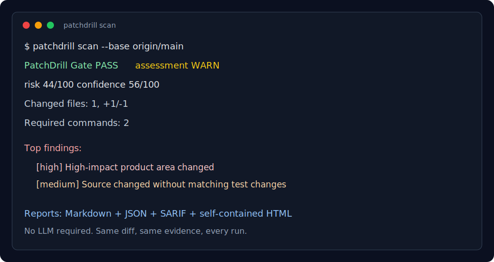

# PatchDrill

PatchDrill is the deterministic proof layer between code review and CI for AI-generated and human patches.

AI PR reviewers answer: "Does this diff look right?" Traditional CI answers: "Did the commands we already configured pass?" PatchDrill answers the missing question: "What proof should exist for this diff before merge?"

It reads a git diff, maps changed files to ecosystems, owners, dependency changes, workflow trust boundaries, risk rules, and verification commands, then emits a portable Proof Pack that reviewers, bots, auditors, and frontier models can inspect without trusting a model judgment.



## 30-Second Demo

Generate a risky AI-agent PR scenario without needing a git repository:

```bash
npx --yes github:seungdori/patchdrill demo --scenario risky-agent-pr --output patchdrill-risky-demo
```

Then inspect the reviewer-facing artifacts:

```bash
cat patchdrill-risky-demo/patchdrill-demo-summary.md
open patchdrill-risky-demo/patchdrill-demo.html
```

PatchDrill should show a privileged workflow boundary, secret-looking content, package lifecycle script risk, and the verification plan a reviewer should ask for before merge.

```bash
npx --yes github:seungdori/patchdrill scan --base origin/main --run \
  --evidence patchdrill-evidence.json \
  --summary-markdown patchdrill-summary.md \
  --markdown patchdrill-report.md \
  --json patchdrill-report.json \
  --sarif patchdrill.sarif \
  --html patchdrill-dashboard.html \
  --fail-on high \
  --max-risk 69
npx --yes github:seungdori/patchdrill verify --evidence patchdrill-evidence.json
```

## Why Star It

- Makes AI-era PRs reviewable without asking another model to be the source of truth.
- Builds a Proof Pack for each patch: Markdown for humans, JSON for bots, SARIF for GitHub code scanning, a self-contained HTML dashboard, compact PR summaries, and a later-verifiable audit manifest with report, artifact, and command-output hashes.
- Works locally first and in CI later. `scan` never mutates the repository, and commands only run when `--run` is set.
- Flags the review surfaces that routinely hide regressions: auth, billing, migrations, secrets, CI workflow supply chain, package automation scripts, infra, lockfiles, large diffs, prompt-injection content, missing test changes, and required checks that were planned but not run.
- Infers reviewable commands from the patch instead of only running root-level defaults.
- Works with the tools you already have: git, npm, pnpm, yarn, bun, pytest, Django, FastAPI, cargo, Go, Maven, Gradle, Spring Boot, Android Gradle, Ruby, Rails, RSpec, PHP, Composer, Laravel, dotnet, ASP.NET Core, Swift, Xcode, Terraform, Docker, Kubernetes, Helm, Bazel, and Buck2.
- Supports policy-as-code through `.patchdrill.yml`, including default, regulated, and agentic starter packs.
- Ships with serious open-source security posture: CodeQL, OpenSSF Scorecard, Dependabot, strict tests, and package dry-run verification.
- Understands Node, Cargo, Go, and Pants workspaces, plus nested Python projects, nested Cargo and Go workspaces, Turborepo, and Nx, targeting changed packages plus downstream dependents instead of blindly running only root-level commands.
- Includes first-party stack fixtures for Node/Turborepo, Next.js, Python, uv-managed Python, Django, FastAPI, Rails, PHP/Composer, Terraform, Docker/Compose, Kubernetes/Helm/Kustomize, Java/Maven/Gradle, Spring Boot Maven/Gradle, Android Gradle, .NET, ASP.NET Core, SwiftPM, Xcode, Bazel, Buck2, Pants, Cargo, and Go repository shapes.
- Explains package.json, pyproject.toml, requirements.txt, NuGet PackageReference and central PackageVersion files, Maven pom.xml, Gradle build files and version catalogs, Gemfile, composer.json, go.mod, Cargo.toml, npm package-lock, pnpm-lock, yarn.lock, bun.lock, go.sum, Cargo.lock, poetry.lock, uv.lock, Pipfile.lock, Gemfile.lock, and composer.lock dependency additions, removals, and version updates instead of only saying "lockfile changed."
- Flags dependency proof gaps such as manifest-only dependency changes or lockfile-only resolution drift.
- Adds CODEOWNERS owner hints to changed files so reviewers can see the responsible teams.
- Includes launch-friendly case studies, a public stack coverage matrix, and per-command verification status so teams can evaluate what evidence PatchDrill actually emits.

## What It Does

PatchDrill answers four questions every reviewer asks:

1. What changed?
2. Which parts of the stack are touched?
3. What should be run to prove this patch?
4. What risk remains after the drill?

PatchDrill is not another AI code reviewer. It does not ask a model whether a diff "looks good." It builds deterministic evidence:

| Layer | Primary question | Deterministic? | Runs commands? | Output |
| --- | --- | --- | --- | --- |
| AI PR reviewer | Does this diff look right? | No | Usually no | Comments, suggestions, design feedback |
| Traditional CI | Did preconfigured checks pass? | Yes | Yes | Logs and pass/fail status |
| SAST/SCA scanner | Does this match a known security or dependency rule? | Yes | Sometimes | Alerts and vulnerability findings |
| Review automation | Did configured review automation fire? | Yes | Sometimes | PR comments and annotations |
| PatchDrill | What proof should exist for this diff? | Yes | Only with `--run` | Proof Pack, risk findings, command plan, policy gate |

The boundary is intentional: models are good at judgment, while PatchDrill is good at producing the same reviewable safety evidence for the same patch every time. Run PatchDrill first, then hand the Proof Pack to a human reviewer, CI gate, audit trail, or frontier model.

## Proof Pack

A Proof Pack is the portable evidence bundle generated for a patch:

- Compact Markdown summary for PR comments and step summaries.
- Full Markdown report for human review.
- JSON report for bots, dashboards, and policy gates.
- SARIF report for GitHub code scanning.
- Self-contained HTML dashboard, including optional trend history.
- Evidence manifest that records report, artifact, and command-output digests.

See [docs/EVIDENCE.md](docs/EVIDENCE.md) for manifest verification and [docs/PROOF_PACKS.md](docs/PROOF_PACKS.md) for how to use Proof Packs in review workflows.

Print the boundary and suggested first commands from the CLI:

```bash
patchdrill explain
```

Example summary:

```text
PatchDrill Gate PASS - assessment WARN, risk 42/100, confidence 58/100
Gate policy: fail-on critical, max-risk 69
Changed files: 4, +121/-18
Required commands: 3, optional commands: 1
Verification evidence: 0 run, 0 passed, 0 failed, 0 timed out, 3 missing required, 1 optional skipped
Added lines inspected: 121
Top findings:
- [high] High-impact product area changed (src/auth/session.ts)
- [medium] Source changed without test changes
Run with --run to execute required verification commands. Add --run-optional to include optional checks.
```

## Install

Use the current GitHub build before the npm package is published:

```bash
npx --yes github:seungdori/patchdrill scan --base origin/main
```

After the npm package is published, use it without installing:

```bash
npx patchdrill scan --base origin/main
```

Or install the published package globally:

```bash
npm install -g patchdrill
patchdrill scan --base origin/main
```

The examples below use `patchdrill` for readability. Replace it with `npx --yes github:seungdori/patchdrill` when running directly from this repository.

## Quickstart

Try the output without a git repository:

```bash
patchdrill demo --output patchdrill-demo
```

Try the failure case that shows what PatchDrill catches in an agent-authored PR:

```bash
patchdrill demo --scenario risky-agent-pr --output patchdrill-risky-demo
```

Diagnose what PatchDrill can infer from your repository before changing CI:

```bash
patchdrill doctor
```

For automation:

```bash
patchdrill doctor --format json
```

Analyze uncommitted work:

```bash
patchdrill scan
```

Analyze a branch against `main`:

```bash
patchdrill scan --base origin/main
```

Run the inferred required commands:

```bash
patchdrill scan --base origin/main --run
```

Include optional checks such as browser/e2e and static-analysis plans:

```bash
patchdrill scan --base origin/main --run --run-optional
```

Write and verify a Proof Pack:

```bash
patchdrill scan --base origin/main --run \
  --evidence patchdrill-evidence.json \
  --summary-markdown patchdrill-summary.md \
  --markdown patchdrill-report.md \
  --json patchdrill-report.json \
  --sarif patchdrill.sarif \
  --html patchdrill-dashboard.html
patchdrill verify --evidence patchdrill-evidence.json
```

Create a static dashboard from a saved JSON report:

```bash
patchdrill dashboard --json patchdrill-report.json --output patchdrill-dashboard.html
```

Verify an evidence manifest against its generated artifacts:

```bash
patchdrill verify --evidence patchdrill-evidence.json
```

Check whether this repository is ready for npm/GitHub Action release:

```bash
patchdrill release-check
patchdrill release-check --format json
```

The release workflow also runs required PatchDrill verification, generates a local Proof Pack smoke bundle, and verifies its evidence manifest before `npm pack --dry-run`.

For automation:

```bash
patchdrill release-check --format json
```

Regenerate an evidence manifest after final artifact post-processing:

```bash
patchdrill evidence --json patchdrill-report.json --evidence patchdrill-evidence.json \
  --summary-markdown patchdrill-summary.md \
  --markdown patchdrill-report.md \
  --sarif patchdrill.sarif \
  --html patchdrill-dashboard.html
```

See committed demo outputs in [examples/demo](examples/demo), including `patchdrill-demo-summary.md` as the PR comment preview.

Read the launch case studies in [docs/CASE_STUDIES.md](docs/CASE_STUDIES.md) and the fixture-backed support matrix in [docs/STACK_COVERAGE.md](docs/STACK_COVERAGE.md).

Add repeated JSON reports in oldest-to-newest order to show run trends:

```bash
patchdrill dashboard --json previous-report.json --json patchdrill-report.json --output patchdrill-dashboard.html
```

Use the GitHub Action with PR comments:

```yaml
- uses: seungdori/patchdrill@v0
  with:
    base: origin/${{ github.base_ref }}
    pr-comment: "true"
```

The Action emits GitHub Checks annotations by default. See [docs/ANNOTATIONS.md](docs/ANNOTATIONS.md).

Use policy-as-code:

```bash
patchdrill scan --config .patchdrill.yml
```

Export JSON Schemas for editors and bots:

```bash
patchdrill schema policy > patchdrill-policy.schema.json
patchdrill schema report > patchdrill-report.schema.json
patchdrill schema evidence > patchdrill-evidence.schema.json
patchdrill schema doctor > patchdrill-doctor.schema.json
patchdrill schema release-check > patchdrill-release-check.schema.json
```

Compare against a previous report:

```bash
patchdrill scan --baseline previous-patchdrill-report.json --max-risk-delta 0 --json patchdrill-report.json
```

Add a GitHub Actions workflow:

```bash
patchdrill init
```

Add a workflow and starter policy:

```bash
patchdrill init --policy
```

Use a stricter starter policy pack:

```bash
patchdrill init --policy-pack regulated
```

## CLI

```text
patchdrill scan [options]
patchdrill dashboard --json <report.json> [--json <report.json>...] [--output <dashboard.html>]
patchdrill demo [--scenario <name>] [--output <directory>]
patchdrill doctor [--format text|json]
patchdrill evidence --json <report.json> --evidence <evidence.json> [artifact options]
patchdrill init [--force] [--policy] [--policy-pack <name>]
patchdrill explain
patchdrill release-check [--format text|json]
patchdrill schema [policy|report|evidence|doctor|release-check] [--output <path>]
patchdrill verify --evidence <patchdrill-evidence.json>
```

Options:

| Option | Description |
| --- | --- |
| `--base <ref>` | Compare against a base ref, for example `origin/main`. |
| `--head <ref>` | Head ref when using `--base`, default `HEAD`. |
| `--config <path>` | Read policy from `.patchdrill.yml/json` or a specific path. |
| `--baseline <path>` | Compare against a previous PatchDrill JSON report. |
| `--evidence <path>` | Write a Proof Pack evidence manifest during `scan`/`evidence`, or select one for `verify`. |
| `--run` | Execute required inferred verification commands. |
| `--run-optional` | With `--run`, also execute optional verification commands. |
| `--github-annotations` | Emit GitHub Actions log annotations for findings. |
| `--summary-markdown <path>` | Write a compact Markdown summary for PR comments or step summaries. |
| `--markdown <path>` | Write a Markdown report. |
| `--json <path>` | Write a JSON report. |
| `--sarif <path>` | Write a SARIF report for GitHub code scanning. |
| `--html <path>` | Write a self-contained static HTML dashboard. |
| `--fail-on <level>` | Fail when findings meet severity: `info`, `low`, `medium`, `high`, `critical`. |
| `--max-risk <score>` | Fail when risk score is above a 0-100 threshold, default `69`. |
| `--max-risk-delta <score>` | Fail when baseline risk increase is above a 0-100 threshold. |
| `--max-output-chars <n>` | Keep the last `n` characters from each command output stream, default `20000`. |
| `--command-timeout-ms <n>` | Stop each verification command after `n` milliseconds. |
| `--quiet` | Only use exit code. |
| `--policy` | Create `.patchdrill.yml` when used with `patchdrill init`. |
| `--policy-pack <name>` | Starter policy pack for `patchdrill init`: `default`, `regulated`, `agentic`. |
| `--scenario <name>` | Demo scenario for `patchdrill demo`: `review-ready`, `risky-agent-pr`. |
| `--format <format>` | Output format for `doctor` and `release-check`: `text`, `json`. |
| `--list` | List available schemas when used with `patchdrill schema`. |
| `--output <path>` | Write a schema/dashboard file or demo artifact directory. |

Boolean flags accept explicit values such as `--run=false`, `--quiet=true`, and `--github-annotations=off`.

## Supported Signals

PatchDrill detects project shape from repo manifests:

| Ecosystem | Signals | Typical commands |
| --- | --- | --- |
| Node | `package.json`, lockfiles, scripts | `npm run typecheck`, `npm run check:types`, `npm run lint`, `npm run test`, `npm run test:unit`, `npm run build`, optional `npm run test:e2e` |
| Python | `pyproject.toml`, `uv.lock`, `requirements.txt`, `setup.py`, `manage.py`, nested Python package roots, `FastAPI()`, FastAPI routers/dependencies, Ruff/mypy/Pyright config | `uv run pytest tests/test_module.py`, `cd packages/api && uv run pytest`, `python -m pytest`, `python manage.py test`, `python -m compileall .`, optional `uv run ruff check .`, optional `uv run mypy .`, optional `uv run pyright`, FastAPI app and changed-module import smoke |
| Rust | `Cargo.toml`, root and nested Cargo workspaces | `cargo test --all-targets`, `cargo test -p crate --all-targets`, `cargo test --manifest-path packages/wasm/Cargo.toml -p crate --all-targets`, `cargo clippy -p crate --all-targets -- -D warnings` |
| Go | `go.mod`, `go.work`, nested Go module and workspace roots | `go test ./...`, `cd services/api && go test ./...`, `go test ./module/...`, `cd services/go && go test ./module/...`, `go vet ./module/...` |
| Java/Kotlin | `pom.xml`, `build.gradle`, wrappers | `mvn test`, `gradle test`, `./gradlew test`, `./gradlew bootJar` |
| Android | `com.android.application`, `com.android.library`, `AndroidManifest.xml`, build types, product flavors, `variantFilter`, variant source sets, generated source paths | `./gradlew testDebugUnitTest`, `./gradlew testReleaseUnitTest`, `./gradlew testFreeDebugUnitTest`, `./gradlew testMinApi24DemoDebugUnitTest`, `./gradlew assemble<Variant>`, `./gradlew lint<Variant>` |
| Ruby/Rails | `Gemfile`, `Gemfile.lock`, `config/application.rb`, RSpec metadata | `bin/rails test`, `bundle exec rails test`, `bundle exec rspec`, `bundle exec rake test` |
| PHP/Laravel | `composer.json`, `composer.lock`, `artisan`, `phpunit.xml` | `composer validate --strict`, `composer test`, `php artisan test`, `vendor/bin/phpunit`, PHP syntax lint fallback |
| .NET | `global.json`, `.slnf`, `.sln`, `.csproj`, `ProjectReference` | `dotnet test App.slnf`, `dotnet test tests/Api.Tests/Api.Tests.csproj`, `dotnet build src/Api/Api.csproj --no-restore`, `dotnet publish src/Api/Api.csproj --no-restore` |
| Swift | `Package.swift`, `Package.resolved`, `*.swift` | `swift test`, `swift build` |
| Xcode | `.xcworkspace`, `.xcodeproj`, shared `.xcscheme`, `.xctestplan`, Apple app source/resources, scheme target platforms | `xcodebuild -workspace App.xcworkspace -scheme App -testPlan AppTests test`, `xcodebuild -project App.xcodeproj -scheme App -destination generic/platform=iOS build`, `xcodebuild -project App.xcodeproj -scheme App -showdestinations` |
| Terraform | `*.tf`, `*.tfvars` | `terraform fmt -check && terraform validate` |
| Docker | `Dockerfile`, Compose files | `docker build .`, `docker compose -f compose.yaml config` |
| Kubernetes | `Chart.yaml`, `kustomization.yaml`, `k8s/`, `kubernetes/`, `manifests/` | `helm lint .`, `kubectl kustomize .`, `kubectl apply --dry-run=client -f k8s` |
| Bazel | `MODULE.bazel`, `WORKSPACE`, `BUILD.bazel`, `.bazelrc` | `bazel test //path/...`, `bazel build //path/...`, `bazel query 'rdeps(//..., set(//path/...))'`, optional downstream `tests(rdeps(...))` promotion, graph-wide fallback for root metadata |
| Buck2 | `.buckconfig`, `BUCK`, `BUCK.v2` | `buck2 test //path/...`, `buck2 build //path/...`, `buck2 uquery 'rdeps(//..., set(//path/...))'`, optional downstream `testsof(rdeps(...))` promotion, graph-wide fallback for root metadata |
| Pants | `pants.toml` | `pants --changed-since=HEAD --changed-dependents=transitive test` |
| GitHub Actions | `.github/workflows/*` | workflow diff review |

For Node workspaces, PatchDrill detects `package.json` workspaces and `pnpm-workspace.yaml`, then emits package-scoped commands such as `pnpm --filter @acme/api run test` or `npm --workspace @acme/api run build` for directly changed packages and downstream dependents. When `turbo.json` or `nx.json` is present, it plans native task-runner commands such as `pnpm exec turbo run test --filter=@acme/api` or `npx nx run api:test`. See [docs/MONOREPOS.md](docs/MONOREPOS.md).

For nested Python projects, PatchDrill treats each discovered `pyproject.toml`, `uv.lock`, `requirements.txt`, or `manage.py` package root as its own verification scope, so a monorepo can plan `cd packages/pine-engine && uv run pytest` instead of incorrectly collapsing every Python change into a root command.

For Cargo workspaces, including workspaces nested below a JavaScript or polyglot monorepo root, PatchDrill reads `[workspace].members`, crate names, and workspace-internal dependencies, then emits `cargo test -p crate --all-targets` or `cargo test --manifest-path packages/wasm/Cargo.toml -p crate --all-targets` plus optional clippy plans for changed crates and downstream dependent crates.

For nested Go modules and Go workspaces, PatchDrill treats each discovered `go.mod` or `go.work` root as its own verification scope. For Go workspaces, PatchDrill reads `go.work` `use` entries, module names, and workspace-internal `require` dependencies, then emits `go test ./module/...` or `cd services/go && go test ./module/...` plus optional `go vet` plans for changed modules and downstream dependent modules.

For Pants repositories, PatchDrill uses Pants' native Git-aware changed target selection with `--changed-since` and `--changed-dependents=transitive`, so Pants keeps ownership of target graph expansion across languages.

## Risk Model

PatchDrill scores a patch from 0 to 100. Higher is riskier.

The current deterministic rules look for:

- Any changed files that need review and verification evidence.
- Secret-bearing files such as `.env` and private keys.
- Secret-looking values added inside the diff, including private keys and common token formats.
- Prompt-injection instructions added to agent-visible files such as `AGENTS.md`, issue templates, and Markdown docs.
- High-impact paths: auth, billing, sessions, migrations, security, crypto, permissions.
- Infra and release behavior: Docker, Terraform, Kubernetes, GitHub Actions.
- Workflow supply-chain risk: broad token writes, `pull_request_target`, inherited secrets, local reusable workflow fan-out to mutable remote reusable workflows, mutable reusable workflows receiving inherited secrets or caller OIDC permissions, environment-scoped OIDC deployment jobs, cloud OIDC credential exchange without environment protection, unpinned actions, mutable `docker://` action images, remote script pipes, untrusted PR metadata interpolation, and privileged PR-head checkout combinations.
- Package automation script risk: install/prepare/pack/publish lifecycle scripts, verification scripts removed or replaced with no-op commands, and package scripts that pipe remote downloads into interpreters.
- Dependency manifest and lockfile changes.
- package.json, pyproject.toml, requirements.txt, NuGet PackageReference and central PackageVersion files, Maven pom.xml, Gradle build files and version catalogs, Gemfile, composer.json, go.mod, Cargo.toml, npm package-lock, pnpm-lock, yarn.lock, bun.lock, go.sum, Cargo.lock, poetry.lock, uv.lock, Pipfile.lock, Gemfile.lock, and composer.lock dependency additions, removals, and updates.
- Dependency proof gaps: direct dependency manifest changes without matching lockfile evidence, and lockfile resolution changes without matching manifest dependency intent.
- Legacy binary `bun.lockb` changes with guidance to migrate toward the text `bun.lock` format.
- Source changes without nearby, mirrored, or framework-convention matching test changes.
- Large line deltas and binary files.
- Required verification commands that were inferred or configured but not run.
- Failed verification commands.
- Custom policy rules from `.patchdrill.yml`.

The risk model is intentionally explainable. Every score increase is represented as a finding in the report.

See [docs/RULE_CATALOG.md](docs/RULE_CATALOG.md) for the built-in rule IDs and what each one means.

## Policy-As-Code

PatchDrill reads `.patchdrill.yml`, `.patchdrill.yaml`, or `.patchdrill.json` from the repository root.

```yaml
failOn: high
maxRisk: 69

ignoredPaths:
  - generated/**

requiredCommands:
  - id: contract-tests
    command: npm run test:contracts
    reason: API surfaces changed.

rules:
  - id: payments-owner-review
    title: Payments owner review required
    severity: critical
    path: src/payments/**
```

See [docs/POLICY.md](docs/POLICY.md).

## GitHub Actions

Generate a workflow:

```bash
patchdrill init
```

Or add it manually:

```yaml
name: PatchDrill

on:
  pull_request:

permissions:
  contents: read
  pull-requests: write
  security-events: write

jobs:
  patchdrill:
    runs-on: ubuntu-latest
    steps:
      - uses: actions/checkout@v6
        with:
          fetch-depth: 0
      - uses: seungdori/patchdrill@v0
        id: patchdrill
        with:
          base: origin/${{ github.base_ref }}
          evidence: patchdrill-evidence.json
          summary: patchdrill-summary.md
          markdown: patchdrill-report.md
          json: patchdrill-report.json
          sarif: patchdrill.sarif
          html: patchdrill-dashboard.html
          fail-on: high
          max-risk: "69"
          run: "true"
          command-timeout-ms: "600000"
          annotations: "true"
          step-summary: "true"
          pr-comment: "true"
          # Optional: newline-separated previous JSON reports downloaded from earlier artifacts.
          # dashboard-history: |
          #   reports/patchdrill-previous.json
      - uses: github/codeql-action/upload-sarif@v4
        if: always()
        with:
          sarif_file: ${{ steps.patchdrill.outputs.report-sarif }}
      - uses: actions/upload-artifact@v7
        if: always()
        with:
          name: patchdrill-report
          path: |
            ${{ steps.patchdrill.outputs.report-evidence }}
            ${{ steps.patchdrill.outputs.report-markdown }}
            ${{ steps.patchdrill.outputs.report-summary }}
            ${{ steps.patchdrill.outputs.report-json }}
            ${{ steps.patchdrill.outputs.report-html }}
            ${{ steps.patchdrill.outputs.report-sarif }}
```

Action boolean inputs accept explicit values: `"true"`, `"false"`, `"1"`, `"0"`, `"yes"`, `"no"`, `"on"`, and `"off"`. Execution and annotation toggles are passed through the same CLI boolean parser, so `run: "false"` never executes repository commands.

## Example Report

See [examples/report.md](examples/report.md).
For Proof Pack review workflows, see [docs/PROOF_PACKS.md](docs/PROOF_PACKS.md).
For code scanning integration, see [docs/SARIF.md](docs/SARIF.md).
For repository security posture, see [docs/SECURITY_POSTURE.md](docs/SECURITY_POSTURE.md).
For pull request comments, see [docs/PR_COMMENTS.md](docs/PR_COMMENTS.md).
For static HTML dashboards, see [docs/DASHBOARD.md](docs/DASHBOARD.md).
For evidence manifest verification, see [docs/EVIDENCE.md](docs/EVIDENCE.md).
For machine-readable schemas, see [docs/SCHEMAS.md](docs/SCHEMAS.md).
For owner hints, see [docs/CODEOWNERS.md](docs/CODEOWNERS.md).
For risk deltas, see [docs/BASELINES.md](docs/BASELINES.md).
For the built-in risk rules, see [docs/RULE_CATALOG.md](docs/RULE_CATALOG.md).

## Release Provenance

PatchDrill includes a release workflow for npm trusted publishing and provenance. Configure the package as a trusted publisher in npm, then publish from a GitHub Release. See [docs/RELEASE.md](docs/RELEASE.md).

Before publishing, run:

```bash
patchdrill release-check
```

## Dependency Review

PatchDrill summarizes dependency changes from changed `package.json`, `pyproject.toml`, `requirements.txt`, NuGet `PackageReference` / `PackageVersion` manifests, Maven `pom.xml`, Gradle `build.gradle` / `build.gradle.kts` / `libs.versions.toml`, `Gemfile`, `composer.json`, `go.mod`, `Cargo.toml`, npm `package-lock.json`, `pnpm-lock.yaml`, `yarn.lock`, `bun.lock`, `go.sum`, `Cargo.lock`, `poetry.lock`, `uv.lock`, `Pipfile.lock`, `Gemfile.lock`, and `composer.lock` files, listing the package, dependency section or lockfile path, change type, previous version, and new version in Markdown and JSON reports. It also flags dependency proof gaps, such as direct manifest changes without matching lockfile evidence or lockfile-only resolution drift without manifest intent. This complements heavier SCA tools by making reviewer-visible dependency intent explicit.

## Package Script Review

PatchDrill also summarizes `package.json` script additions, removals, and updates in Markdown, JSON, and HTML reports. Risk findings call out install/prepare/pack/publish lifecycle hooks, no-op verification scripts, removed test/lint/build scripts, and package scripts that pipe remote downloads into interpreters.

## Design Principles

- Deterministic first. No model call is required to get a useful answer.
- Proof Packs over vibes. A reviewer should see the exact commands, findings, artifacts, and digests.
- Local by default. Source code stays in your checkout.
- Conservative scoring. PatchDrill would rather ask for proof than silently bless a risky patch.
- Extensible later. The rule engine is small enough for contributors to add ecosystems and policies.
- Trustworthy distribution. CI verifies build, tests, SARIF generation, and npm package contents.

## Roadmap

- Broader first-party fixture coverage for common open-source stacks.
- More native affected-task integrations beyond Turborepo, Nx, Pants, Cargo, Go, Bazel, and Buck workspaces.
- Local TUI for interactively accepting or rejecting inferred verification commands.
- Optional LLM summary mode that never replaces deterministic findings.

## Contributing

Read [CONTRIBUTING.md](CONTRIBUTING.md). Good first contributions are new ecosystem detectors, risk rules, and real-world report fixtures.

## Security

PatchDrill executes commands only when you pass `--run`. It runs inferred required commands in your repository shell; optional commands require both `--run` and `--run-optional`. When required checks are planned but not executed, PatchDrill reports that as missing verification evidence instead of silently treating the patch as proven. Markdown, compact summaries, the HTML dashboard, and console output label each planned command as passed, failed, timed out, not run, or skipped optional. `patchdrill init` writes a CI workflow with `run: "true"` and a per-command timeout so pull requests produce command evidence by default. Review the verification plan first when scanning untrusted repos. See [SECURITY.md](SECURITY.md).

## License

MIT
